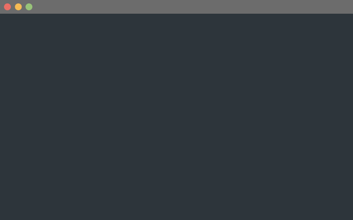

# Moving The Cursor with hjkl

In Neovim, the most basic way to move around is by using the hjkl keys.

Here’s what each key does with the finger to press:

```
⬅️ h: index finger
⬇️ j: index finger
⬆️ k: middle finger
➡️ l: ring finger
```



Make sure that your index finger is always on the letter j. So even after you
move the finger to the left to press h, it should go back to the letter j
immediately after.

Spend at least a few days getting used to moving around with hjkl with the
exercise below. Your fingers need to build muscle memory, so repetition is
essential. You’ll know you’ve mastered this when your fingers press the right
keys without consciously thinking about it.

Remember: mastery is built through steady, consistent effort.
1. Learn one thing
2. Practice until you can do it without thinking
3. Repeat Repeat Repeat

```admonish tip title='Exercise'
1. Install Vimium Extension
2. Use jk to scroll whenver you are viewing a web page
3. Keep doing it
4. Do not go to the next page until it becomes automatic
```
