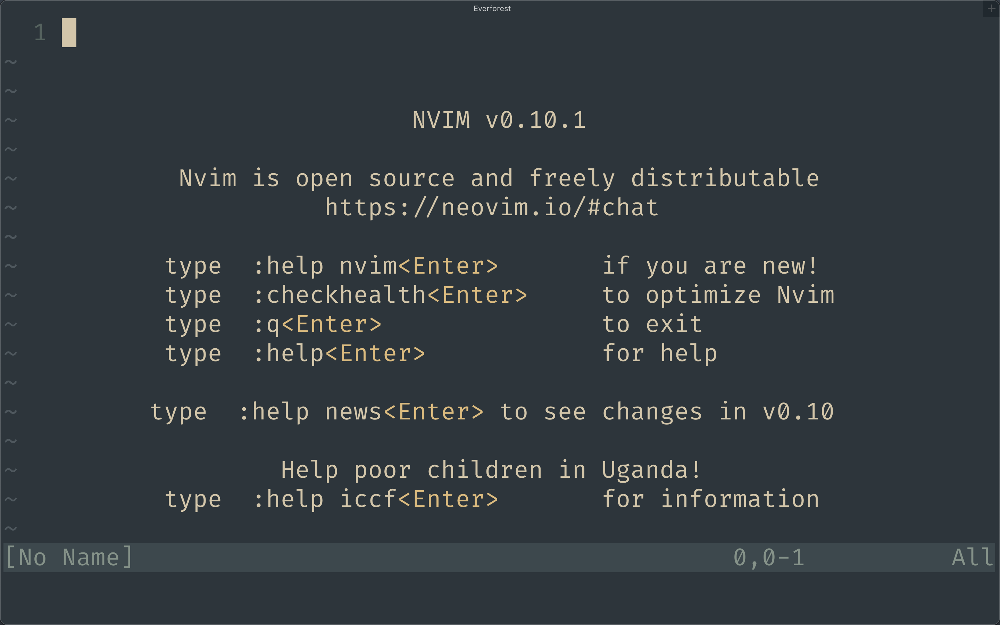

# Opening and Closing Neovim

First we have to be able to open Neovim before we can use it.
To start Neovim, simply open a terminal and type:

```bash
nvim
```

```admonish info
Notice that it is __nvim__ and not __neovim__
```

You should see a welcome screen like the picture below:



To close Neovim, press ZZ. It should exit Neovim and take you back to the
shell. There are many other ways to close Neovim but I think this is the
simplest. Just need to know one anyway. If you are cusious Google can give you
more than enough materials to read. Let's keep our lesson short and sweet. 

```admonish summary
- nvim
- ZZ
```
